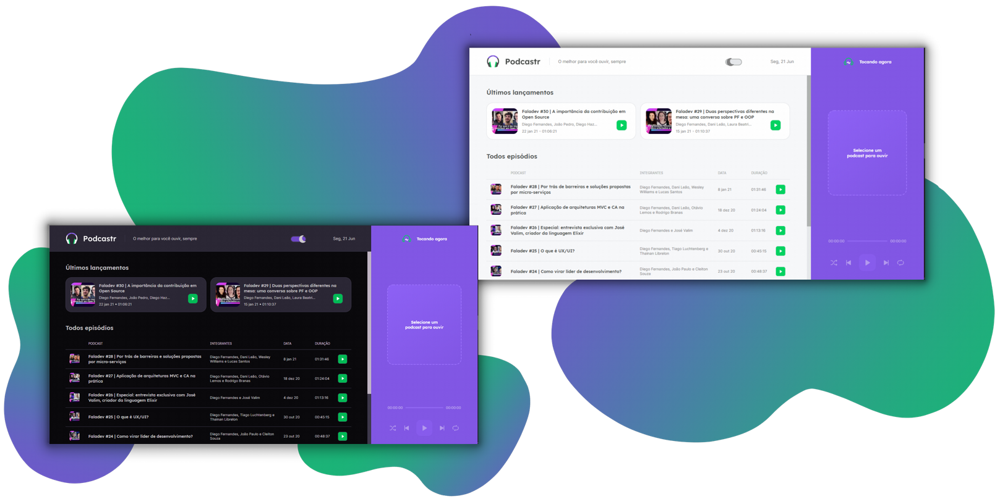

<p align="center">
  
</p>

<p align="center">
  <a href="#-tecnologias">Tecnologias</a>&nbsp;&nbsp;&nbsp;&nbsp;|&nbsp;&nbsp;&nbsp;&nbsp;
  <a href="#-projeto">Projeto</a>&nbsp;&nbsp;&nbsp;&nbsp;|&nbsp;&nbsp;&nbsp;&nbsp;
  <a href="#-como-rodar">Como rodar</a>&nbsp;&nbsp;&nbsp;&nbsp;
</p>

<p align="center">
  
</p>

## 💻 Tecnologias

As tecnologias utilizadas foram:

- React
- Next.js
- TypeScript
- Sass

## 🚀 Projeto

O Podcastr foi um projeto construído na trilha de ReactJs da quinta edição da NLW(Next Level Week), evento da Rocketseat.
Podcastr é uma plataforma para transmissão de podcast.

## ⚙ Como rodar

Clone o repositório com o comando:
``` bash
git clone https://github.com/alt-jams/nlw-05.git 
```
Entre no projeto e instale as dependencias com o comando:
``` bash
yarn
```
Rode o servidor falso:
``` bash
yarn server
```
Inicie o projeto:
``` bash
yarn dev
```
Então, a aplicação pode ser acessada no endereço http://localhost:3000

<p align="center">
    💜
</p>
